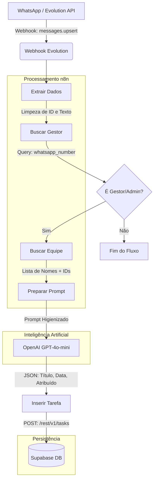

# Arquitetura do Fluxo: OpsControl Standalone

Este diagrama representa o fluxo lógico do workflow `07-standalone-with-credentials.json` no n8n.

## Detalhes das Etapas:

1.  **Recepção**: O Webhook aguarda qualquer interação da Evolution API.
2.  **Validação**: O sistema consulta seu banco no Supabase para ver se quem enviou a mensagem é um gestor autorizado.
3.  **Contexto**: Para que a IA não "invente" nomes, o n8n busca a lista real de funcionários da sua empresa.
4.  **Higiene de Dados**: O nó *"Preparar Prompt"* garante que falhas de conexão ou nomes vazios não quebrem a IA.
5.  **Decisão**: O GPT-4o-mini decide quem é o responsável, qual o prazo e a prioridade.
6.  **Ação**: O n8n grava o resultado direto no banco de dados.

> [!NOTE]
> Este fluxo é totalmente autônomo e não depende de nenhuma "Edge Function" do Supabase, o que evita erros de deploy no Lovable.
